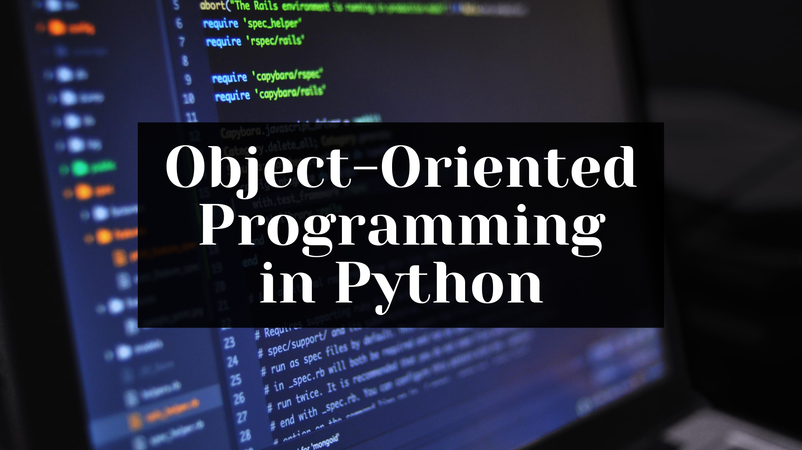

# Object Oriented Programming basics with Python



Welcome to the Python OOP Concepts repository! 👋🏻

This repository is dedicated to explaining the Object-Oriented Programming (OOP) paradigm in Python through a single comprehensive example, which is a _Vehicle Management System_.

## Table of Contents

1. [Introduction to OOP](#introduction_to_oop)
2. [Single Example Concept](#single_example_concept)
3. [License](#license)

---

<div id='introduction_to_oop'/>

### 1. Introduction to OOP:

Object-oriented Programming (OOP) is a computer programming model that organizes software design which revolves around concept of classes , objects and its entities.

OOP is required and widely used for several reasons like to keep code organized (Encapsulation) , enhance reusability (Acheived with Inheritance and polymorphism), ease of modification (Modularity), simplifying complexity (Abstraction) and to more robust and reliable software.

<div id='single_example_concept'/>

### 2. Single Example Concept

In this example, we will model different types of vehicles like cars, motorbikes and manage them in a `Vehicle Management system`.

#### a. Create a base class for `Vehicle` that represents a general vehicle

- Created a `Vehicle` class with attributes and methods to represent a general vehicle.
- Added `__init__` magic method to define default behaviour and attributes to Vehicle class.

```
 def __init__(self,model,make,year) -> None:
        self.__make = make
```

- Encapsulated the vehicle's make, model, and year with private attributes and provided getter methods.

#### b. Created `Car` and `Motorbike` classes that inherit from Parent class `Vehicle`

- Created child classes for `Vehicle` - `Car` and `Motorbike`.
- Added specific attributes and methods to each child class : Car - number of doors and Motorbike - with clutch or clutchless.
- Overrode the `display` method for both with additional details of each child class.

#### c. Composition and Encapsulation:

- Created a `VehicleManager` class to manage a collection of Vehicle objects.
- Added methods to add, remove, and retrieve vehicles, encapsulating the list of vehicles within the VehicleManager class.

#### d. Polymorphism

- Overrode the display method in both Car and motorbike classes to provide specific output.
- The `display_all_vehicles` method in `VehicleManager` calls the appropriate display method for each vehicle, demonstrating polymorphism.

#### e. Added main.py

- In `main.py`, created instances of Car and motorbike, added them to `VehicleManager`, and demonstrated how to manage and interact with these vehicles.

<div id='license'/>

### 3. License

This project is licensed under the MIT License. See the [LICENSE](LICENSE) file for details.
